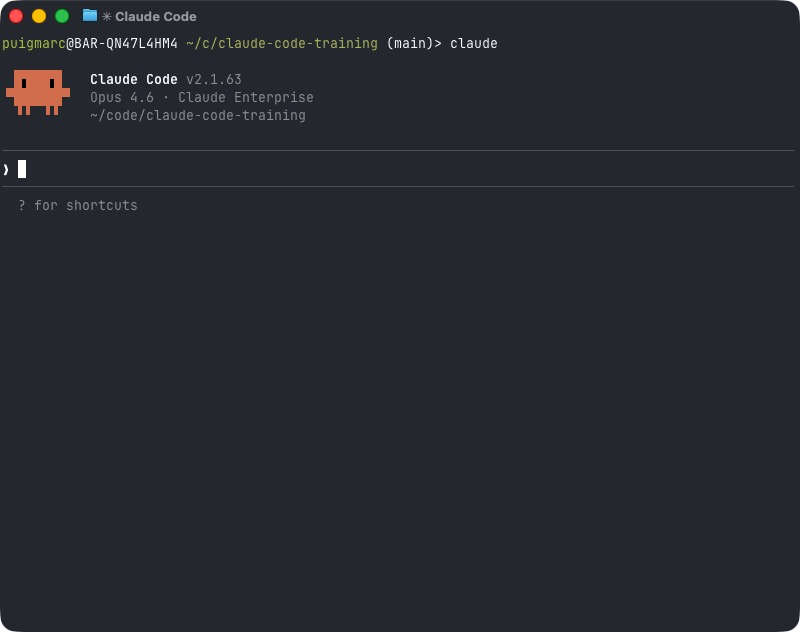

# Install Claude Code

> **Time:** 5 minutes | **Prerequisites:** A laptop with terminal access and a Claude account

For detailed, platform-specific installation guides (including corporate network setup, API key configuration, and troubleshooting), see:

- [Mac Installation Guide](install-mac.md)
- [Windows Installation Guide](install-windows.md)

The quick-start steps below cover the essentials.

## Step 1: Install Claude Code

Open your terminal application and paste the appropriate command:

**macOS / Linux:**

```bash
curl -fsSL https://claude.ai/install.sh | sh
```

**macOS (Homebrew):**

```bash
brew install claude-code
```

**npm (all platforms, requires Node.js 18+):**

```bash
npm install -g @anthropic-ai/claude-code
```

**Windows (PowerShell):**

```powershell
irm https://claude.ai/install.ps1 | iex
```

> **Tip for Mac users:** Open the Terminal app from Applications > Utilities, or search for "Terminal" in Spotlight (Cmd + Space).

## Step 2: Authenticate

Once installed, start Claude Code by typing:

```bash
claude
```

The first time you run it, Claude Code will ask you to log in with your Claude account. Follow the on-screen instructions to authenticate via your browser.



_Example of Claude Code running in the terminal after login._

## Step 3: Orient Yourself

After authentication, you are in a Claude Code session. This is where you will work. Here is what you need to know:

### Essential Commands

| Command | What It Does |
|---------|-------------|
| `/help` | Shows available commands and usage tips |
| `/clear` | Clears the current conversation and starts fresh |
| **Shift+Tab** | Switches between modes (Plan, Edit, Auto-accept) |
| `/quit` or **Ctrl+C** | Exits Claude Code |

## Step 4: Try Your First Instruction

Type something simple to confirm everything works:

```text
What is the current Solvency II standard formula SCR calculation structure?
Give me a brief overview in plain language.
```

Claude Code will respond directly in your terminal. You are ready to go.

---

## Quick Reference: Working Modes (Shift+Tab)

Claude Code has three modes you can cycle through by pressing **Shift+Tab**:

| Mode | Behavior | When to Use |
|------|----------|-------------|
| **Plan** | Claude Code explains what it would do, but takes no action | When you want to review before Claude Code makes changes |
| **Edit** | Claude Code makes changes but asks for your approval first | Default mode, good for most work |
| **Auto-accept** | Claude Code makes changes without asking | When you trust the workflow and want speed |

Start in **Edit** mode. You can always switch later.

---

## Next Step

For non-technical executive users, start with [Exercise 0: Executive Onramp (Zero to One)](../../../exercises/exercise-0-executive-onramp/README.md).
Then proceed to [Module 1.1: First Steps with Claude Code](../../1-fundamentals/1.1-first-steps/README.md) to learn how to give effective instructions and complete your first insurance tasks.
