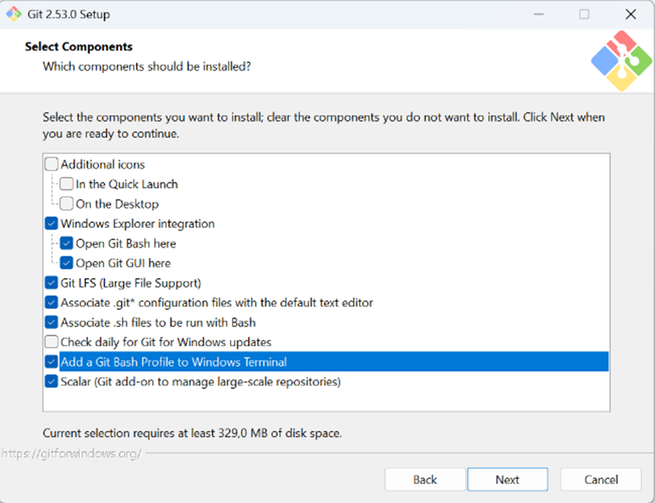

# Claude Code Installation Guide for Windows

> **Time:** ~10 to 20 minutes | **Prerequisites:** Windows 10 or later, permission to install apps

### Step 1: Install Git for Windows

1. Go to **https://git-scm.com/download/win**
2. Download **Git for Windows**
3. Run the installer — on the **Select Components** screen, make sure **"Add a Git Bash Profile to Windows Terminal"** is checked (it is unchecked by default)



### Step 2: Open PowerShell

Press `Windows`, type `PowerShell`, and open it.

### Step 3: Set up the Git Bash path

Some Windows setups need this so Claude Code can find Git Bash. Run this once:

```powershell
$bashPath = @(
  "$env:LOCALAPPDATA\Programs\Git\bin\bash.exe",
  "C:\Program Files\Git\bin\bash.exe"
) | Where-Object { Test-Path $_ } | Select-Object -First 1

if ($bashPath) {
  [Environment]::SetEnvironmentVariable("CLAUDE_CODE_GIT_BASH_PATH", $bashPath, "User")
  Write-Host "Saved Git Bash path:" $bashPath
} else {
  Write-Host "Git Bash not found. Install Git for Windows first."
}
```

### Step 4: Install Claude Code

Run this command:

```powershell
irm https://claude.ai/install.ps1 | iex
```

### Step 5: Add Claude to your PATH

If PowerShell does not recognize the `claude` command after installing, run this once:

```powershell
$claudeDir = "$env:USERPROFILE\.local\bin"

if (Test-Path "$claudeDir\claude.exe") {
  [Environment]::SetEnvironmentVariable(
    "PATH",
    $env:PATH + ";$claudeDir",
    "User"
  )
  Write-Host "Added to PATH:" $claudeDir
} else {
  Write-Host "Claude not found in $claudeDir. Re-run the installer in Step 4."
}
```

### Step 6: Close PowerShell, reopen it, and start Claude Code

```powershell
claude
```

Claude Code should open and ask you to sign in in your browser. After login, return to PowerShell and continue in the terminal window.

### Step 7: Confirm it works

```powershell
claude --version
```

If you see a version number and `claude` opens, you are done.
