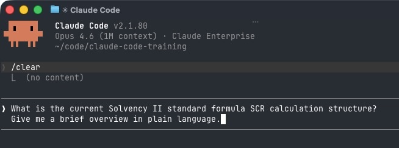

import { Os, Mac, Win } from '../../components/os'

# Quick Start

> **Time:** 5 minutes | **Prerequisites:** A laptop with terminal access and a Claude account

## Step 1: Install Claude Code

Follow the guide for your platform:

<Mac>
- [Mac Installation Guide](/getting-started/install-mac)
</Mac>
<Win>
- [Windows Installation Guide](/getting-started/install-windows)
</Win>

## Step 2: Orient Yourself

After authentication, you are in a Claude Code session. This is where you will work. Here is what you need to know:

### Essential Commands

| Command | What It Does |
|---------|-------------|
| `/help` | Shows available commands and usage tips |
| `/clear` | Clears the current conversation and starts fresh |
| **Shift+Tab** | Switches between modes (Plan, Edit, Auto-accept) |
| `/quit` or **Ctrl+C** | Exits Claude Code |

## Step 3: Try Your First Instruction

Type something simple to confirm everything works:

```text
What is the current Solvency II standard formula SCR calculation structure?
Give me a brief overview in plain language.
```



Press **Enter** and Claude Code will respond directly in your terminal. You are ready to go.

<details>
<summary>Example output</summary>

The Solvency II standard formula calculates the **Solvency Capital Requirement (SCR)** — the minimum capital an insurer must hold to survive a 1-in-200-year adverse event. The structure works bottom-up:

1. **Individual risk modules** — each major risk type gets its own capital charge:
   - **Market risk** (interest rates, equity, property, currency, spread, concentration)
   - **Counterparty default risk** (reinsurer or debtor failure)
   - **Life underwriting risk** (mortality, longevity, disability, lapse, expense, catastrophe)
   - **Health underwriting risk** (similar sub-risks, health-specific)
   - **Non-life underwriting risk** (premium/reserve, lapse, catastrophe)

2. **Aggregation with correlation matrices** — the sub-modules within each risk type are combined using prescribed correlation matrices, then the five top-level modules are aggregated the same way. This diversification benefit reduces the total.

3. **Add-ons** — the aggregated figure is adjusted for:
   - **Operational risk** (a formulaic add-on)
   - **Loss-absorbing capacity** of technical provisions and deferred taxes (reduces the SCR)
   - **Intangible asset risk** (if applicable)

**Result:** the final SCR number in EUR, which the insurer compares against its **Own Funds** to derive the **Solvency II ratio** (Own Funds ÷ SCR). A ratio above 100% means compliant; most insurers target well above that.

</details>

---

## Quick Reference: Working Modes (Shift+Tab)

Claude Code has three modes you can cycle through by pressing **Shift+Tab**:

| Mode | Behavior | When to Use |
|------|----------|-------------|
| **Plan** | Claude Code explains what it would do, but takes no action | When you want to review before Claude Code makes changes |
| **Edit** | Claude Code makes changes but asks for your approval first | Default mode, good for most work |
| **Auto-accept** | Claude Code makes changes without asking | When you trust the workflow and want speed |

Start in **Edit** mode. You can always switch later.

---

## Next Step

For non-technical executive users, start with [Exercise 1: Executive Onramp](/exercises/executive-onramp).
Then proceed to [Module 2.1: First Steps with Claude Code](/fundamentals/first-steps) to learn how to give effective instructions and complete your first insurance tasks.
