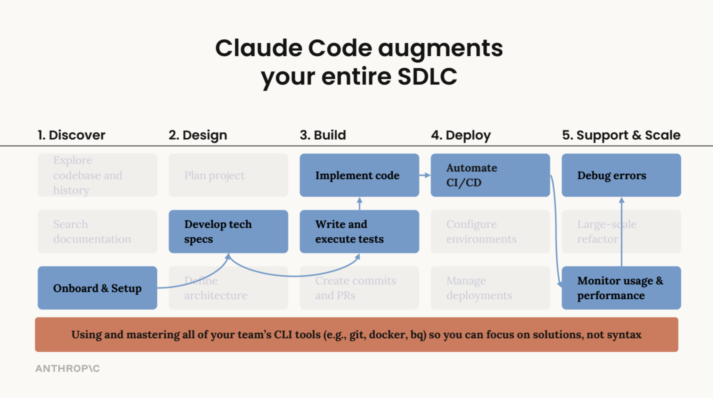

# What Is Claude Code?

> **Time:** 5 minutes | **Prerequisites:** None

Claude Code is a command-line tool that lets you work with Claude directly in your terminal using natural language. You type instructions in plain English (or Spanish, or any language), and Claude reads your files, writes documents, searches the web, and runs tasks for you.

**You do not need to know how to code.** You give instructions. Claude does the work.

---

### What Can Claude Code Do?

- **Read files** on your computer (reports, spreadsheets, documents)
- **Write and create files** (briefs, summaries, emails, analyses)
- **Search the web** for up-to-date market data, regulations, and news
- **Organize and analyze data** from CSVs, Excel exports, and other files
- **Run commands** on your system (create folders, manage files)

### What It Cannot Do

- Access your email or calendar directly
- Log into websites on your behalf
- Replace your professional judgment on underwriting or compliance decisions

---

## Beyond individual tasks: where Claude Code helps

Teams use Claude Code across planning, analysis, documentation, delivery, and follow-up work. In this course, the focus is practical business use: briefs, research, data analysis, reporting, and lightweight prototypes.

_Claude Code can support a workflow from early scoping through delivery and follow-up._

_Anthropic uses Claude Code across many functions, not only engineering teams._

---

## Next Step

Proceed to [Install Claude Code](/getting-started/install) to set up your environment.
